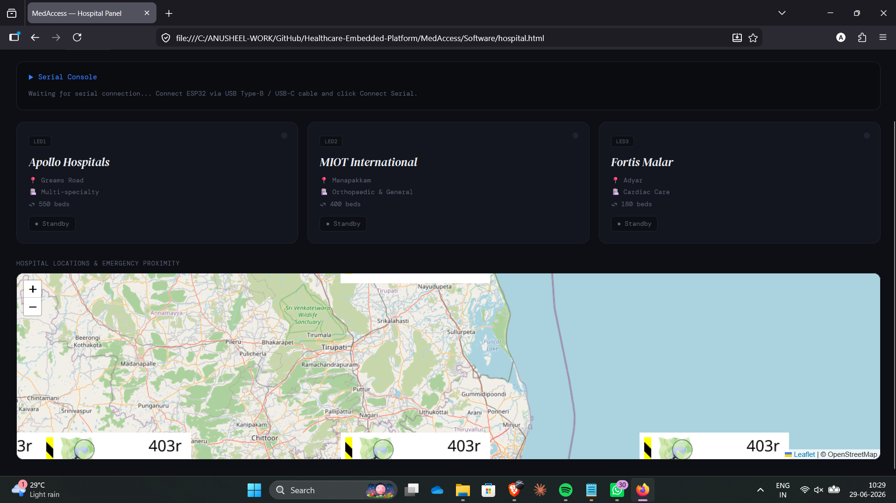
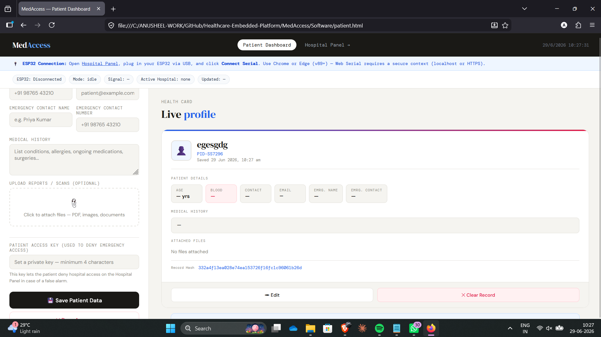

\# 🏥 MedAccess – Smart Healthcare Embedded Platform


> An IoT-enabled healthcare monitoring platform integrating embedded systems, web technologies, and real-time communication to improve patient management and hospital accessibility.


\---


\# 🎥 Project Demonstration


🎬 \*\*Watch the complete project demonstration here:\*\*


\*\*https://www.youtube.com/shorts/LAMBLJDcJk4\*\*


\---


\# 📷 Hardware Prototype


<p align="center">

&#x20; 

</p>


\---


\# 🖥️ Hospital Dashboard


<p align="center">

&#x20; 

</p>


\---


\# 👨‍⚕️ Patient Dashboard


<p align="center">

&#x20; 

</p>


\---


\# 📖 Overview


MedAccess is a healthcare-focused embedded systems project that combines ESP32-based hardware with a modern web application to create an integrated patient monitoring and management platform.


The system demonstrates how embedded hardware can communicate with web technologies to provide real-time healthcare information, improve accessibility, and streamline interactions between patients and healthcare providers.


This project was developed to explore Embedded Systems, IoT, Full-Stack Development, and Human-Centered Healthcare Technology.


\---


\# ✨ Features


\* 📡 ESP32 Embedded Firmware

\* 🌐 Web-based Hospital Dashboard

\* 👨‍⚕️ Patient Dashboard

\* 🔄 Real-Time Data Communication

\* 📶 Web Serial API Integration

\* 💾 Browser Storage Support

\* 📱 Responsive User Interface

\* ⚙️ Embedded Hardware \& Software Integration

\* 🏥 Healthcare Information Management


\---


\# 🛠 Hardware Used


\* ESP32 Development Board

\* USB Serial Interface

\* Sensors (Project Dependent)

\* Wi-Fi Communication

\* Embedded Control Hardware


\---


\# 💻 Software Stack


\## Embedded


\* Arduino IDE

\* ESP32 Framework

\* C++


\## Web Technologies


\* HTML

\* CSS

\* JavaScript

\* Web Serial API

\* Local Browser Storage


\---


\# 🏗️ System Architecture


```text

&#x20;               +----------------------+

&#x20;               |      Patient         |

&#x20;               +----------+-----------+

&#x20;                          |

&#x20;                          |

&#x20;                   Web Dashboard

&#x20;                          |

&#x20;                          |

&#x20;                Browser Storage Layer

&#x20;                          |

&#x20;                          |

&#x20;                   Web Serial API

&#x20;                          |

&#x20;                          |

&#x20;                   USB Communication

&#x20;                          |

&#x20;                          |

&#x20;                 ESP32 Microcontroller

&#x20;                          |

&#x20;                          |

&#x20;                Sensors / Hardware Layer

```


\---


\# ⚙️ Working Principle


1\. The ESP32 collects data from connected hardware modules.

2\. Sensor information is transmitted through serial communication.

3\. The Web Serial API establishes communication between the browser and the ESP32.

4\. The Hospital Dashboard displays incoming information.

5\. Browser Storage maintains application state.

6\. Patients and healthcare staff can interact through dedicated interfaces.


\---


\# 📂 Repository Structure


```text

MedAccess/

│

├── Firmware/

│   └── Esp\_32\_MedAccess\_Final.cpp

│

├── Software/

│   ├── hospital.html

│   └── patient.html

│

├── Documentation/

│

├── Images/

│   ├── Hardware\_Setup.jpeg

│   ├── HospitalDashboard.png

│   └── PatientDashboard.png

│

├── Videos/

│

└── README.md

```


\---


\# 🚀 Learning Outcomes


Through this project I gained experience in:


\* Embedded Systems Development

\* ESP32 Programming

\* IoT System Design

\* Hardware–Software Integration

\* Serial Communication

\* Web Serial API

\* Dashboard Development

\* Browser-Based Interfaces

\* System Architecture Design

\* Full-Stack IoT Integration


\---


\# 🔮 Future Improvements


\* Cloud Database Integration

\* MQTT Communication

\* Secure Authentication

\* Mobile Application Support

\* Medical Sensor Integration

\* Patient History Management

\* Remote Monitoring

\* Notification System

\* AI-Based Health Analytics


\---


\# 📚 Technologies


| Category      | Technologies                         |

| ------------- | ------------------------------------ |

| Embedded      | ESP32, Arduino                       |

| Programming   | C++, JavaScript                      |

| Frontend      | HTML, CSS                            |

| Communication | Serial Communication, Web Serial API |

| Storage       | Browser Local Storage                |

| Domain        | Healthcare IoT, Embedded Systems     |


\---


\# ⭐ Project Status


\*\*Completed\*\* ✔️


This repository is part of my \*\*Embedded Systems Engineering Portfolio\*\* and demonstrates the integration of embedded hardware with modern web technologies for healthcare applications.


\---


\## 👨‍💻 Author


\*\*Anusheel Singh\*\*


Electronics and Communication Engineering


Embedded Systems • IoT • Control Systems • Hardware Integration


If you found this project interesting, consider giving the repository a ⭐.


