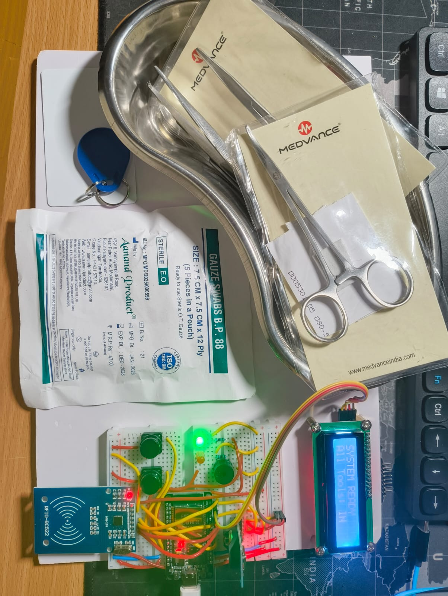
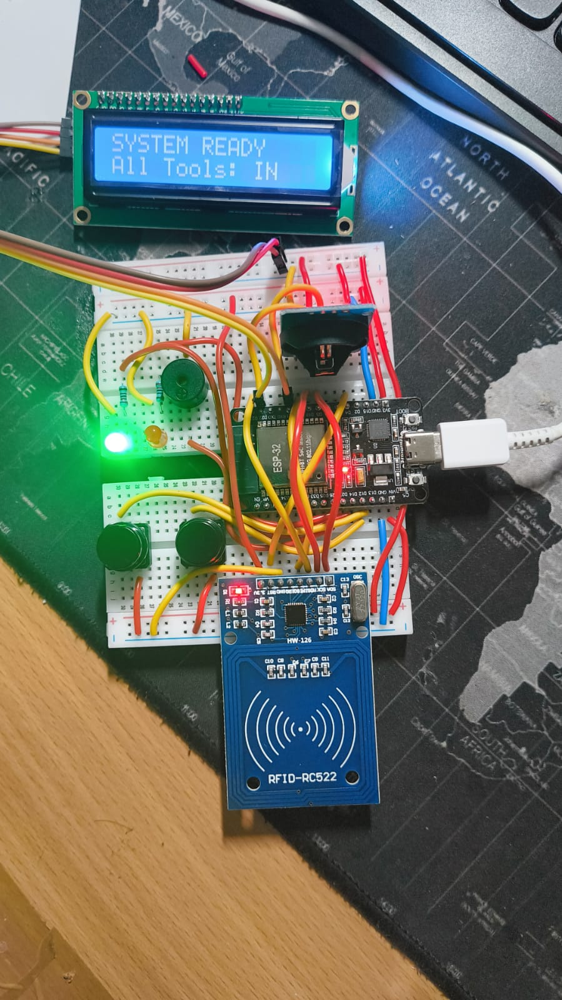

# 📦 Medical RFID Inventory Management System

> An ESP32-based RFID inventory management system for tracking surgical instruments in real time using RFID technology, FastAPI, SQLite, WebSockets, and a modern healthcare dashboard.

---

# 🎥 Project Demonstration

> https://www.youtube.com/watch?v=DTw08SvjALI

---

# 📷 Complete System Setup

<p align="center">
  
</p>

---

# 🔧 Hardware Setup

<p align="center">
  
</p>

---

# 🖥 Dashboard – Inventory Overview

<p align="center">
  
</p>

---

# 🛠 Dashboard – Tool Management

<p align="center">
  
</p>

---

# 📊 Dashboard – Live Inventory Status

<p align="center">
  
</p>

---

# 📖 Overview

The **Medical RFID Inventory Management System** is a healthcare-focused embedded systems project designed to improve the tracking and management of surgical instruments inside hospitals.

The project combines an **ESP32-based RFID reader**, a **FastAPI backend**, **SQLite database**, **WebSocket communication**, and a responsive web dashboard to provide real-time visibility into surgical tool movement.

This project demonstrates the integration of embedded hardware, backend software, databases, and modern web technologies into a complete IoT healthcare solution.

---

# ✨ Features

* 🏷 RFID-Based Surgical Tool Tracking
* 📡 ESP32 Embedded Firmware
* ⚡ FastAPI Backend
* 🗄 SQLite Database
* 🔄 Real-Time WebSocket Communication
* 🖥 Interactive Healthcare Dashboard
* 📟 LCD Display Integration
* ⏰ RTC Timestamp Logging
* 📈 Live Inventory Statistics
* 📋 Surgical Tool History
* 🛠 Editable Tool Metadata
* 🔌 Automatic Serial Port Detection

---

# 🛠 Hardware Used

* ESP32 Development Board
* MFRC522 RFID Reader
* RFID Tags
* LCD Display
* RTC Module
* USB Serial Communication

---

# 💻 Software Stack

## Embedded

* ESP32
* Arduino Framework
* C++

## Backend

* FastAPI
* SQLAlchemy
* SQLite
* WebSocket
* PySerial

## Frontend

* HTML
* CSS
* JavaScript

---

# 🏗 System Architecture

```text
                 RFID Tag
                     │
                     ▼
             MFRC522 RFID Reader
                     │
                     ▼
               ESP32 Firmware
                     │
          Serial Communication
                     │
                     ▼
              FastAPI Backend
                     │
        ┌────────────┴────────────┐
        │                         │
        ▼                         ▼
   SQLite Database          WebSocket Server
        │                         │
        └────────────┬────────────┘
                     ▼
             Web Dashboard
                     │
                     ▼
      Surgical Inventory Management
```

---

# ⚙️ Working Principle

1. RFID tags attached to surgical instruments are scanned.
2. The ESP32 reads the RFID UID.
3. Firmware generates structured JSON events.
4. FastAPI receives and processes incoming serial data.
5. Inventory records are stored in SQLite.
6. The backend broadcasts updates through WebSockets.
7. The dashboard updates instantly without requiring a page refresh.
8. Hospital staff can monitor tool movement, inventory status, and historical events in real time.

---

# 📂 Repository Structure

```text
Medical-RFID-Inventory/
│
├── Firmware/
│
├── Software/
│   ├── Backend/
│   ├── Dashboard/
│   └── Database/
│
├── Documentation/
│
├── Images/
│   ├── Entire_Setup.jpg
│   ├── Hardware_Setup.jpg
│   ├── Dashboard_1.png
│   ├── Dashboard_2.png
│   └── Dashboard_3.png
│
├── Videos/
│
└── README.md
```

---

# 📚 Skills Demonstrated

* Embedded Systems Development
* ESP32 Programming
* RFID Technology
* Hardware–Software Integration
* FastAPI Development
* SQLAlchemy ORM
* SQLite Database Design
* REST API Development
* WebSocket Communication
* Dashboard Development
* Real-Time Monitoring Systems
* Healthcare IoT Applications

---

# 🔮 Future Improvements

* Multi-Reader RFID Support
* Cloud Database Synchronization
* User Authentication
* Mobile Dashboard
* Analytics Dashboard
* RFID Gate Monitoring
* AI-Based Inventory Prediction

---

# 📚 Technologies

| Category      | Technologies          |
| ------------- | --------------------- |
| Embedded      | ESP32, Arduino        |
| RFID          | MFRC522               |
| Backend       | FastAPI, SQLAlchemy   |
| Database      | SQLite                |
| Communication | Serial, WebSocket     |
| Frontend      | HTML, CSS, JavaScript |
| Programming   | C++, Python           |

---

# ⭐ Project Status

**Completed** ✔️

This project is part of my **Healthcare Embedded Systems Platform** and demonstrates the integration of embedded hardware, RFID technology, backend development, databases, and modern web technologies for real-time surgical inventory management.

---

## 👨‍💻 Author

**Anusheel Singh**

Electronics and Communication Engineering

Embedded Systems • IoT • Healthcare Technology • Hardware Integration

⭐ If you found this project interesting, consider giving the repository a star.
